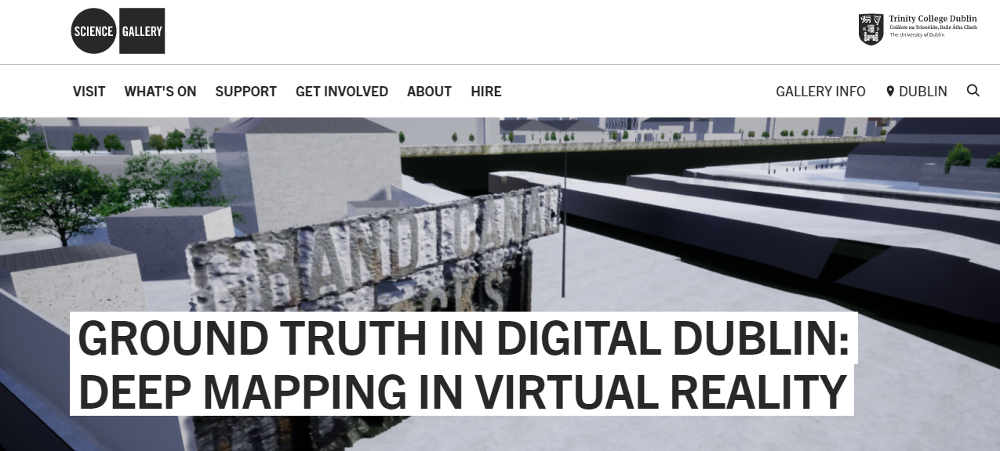

# Ground Truth In Digital Dublin

This repository includes materials and user guides prepared for the public Open Labs workshop [Ground Truth in Digital Dublin: Deep Mapping in Virtual Reality](https://dublin.sciencegallery.com/events/2019/05/groundtruthdigitaldublindeepmappingvirtualreality) at the Science Gallery Dublin in June 2019.

This session explored the possibility of using a virtual environment as the basis for a multisensory 'deep map' which integrates crowd sourced multi-media. These media would be collected during an expedition into the nearby Dublin Docklands SDZ, an area for which a 3D model had recently been commissioned and publicly released as open data. Participants were invited to identify and capture information on the 'points of interest' specified in a legend-less map. In particular they were encouraged to explore the use of digital photography and 'Structure from Motion' with the free and open source software [Meshroom](https://alicevision.github.io/) in order to generate photoreal 3D models. 

These crowd-sourced 3D models then have the potential to be integrated back into the official model with other media including sound and 360 video. In this way participants are facilitated in contributing to the creation of a shared, immersive, multisensory 3D experience that would register their own subjective interests and collective 'ground truth'.

> “Thousands of electronic eyes and ears continuously capture the city’s unfolding, interwoven narrative threads, and spin them out into cyberspace….In countless spatially and temporally displaced, inherently ambiguous fragments, Dublin electronically doubles itself”

> Mitchell, W.J. 2002. [‘Electronic Doublin’](http://volumeproject.org/electronic-doublin/). Volume Project.

Join the Building City Dashboards (BCD) team from Maynooth University to explore the Dublin Docklands in search of the city’s hidden digital double.  Find out how you can capture data for yourself that can contribute to the production of a ‘Digital Twin’ of the city. 

#### Session Outline

In this session, the BCD team will demonstrate a Virtual Reality application showing the ways in which different media captured during the practical activity can be used to create the Dockland’s own three dimensional double or Digital Twin. You’ll learn how to capture a range of urban data, including photoreal 3D models that can be generated from a collection of photos, taken with nothing more than a camera phone. The BCD team will then lead an expedition (on foot) into the Dublin Docklands where you’ll capture sound, still images and 360-degree videos. Back in Science Gallery Dublin, the BCD team will demonstrate a Virtual Reality application showing the ways in which different media captured during the practical activity can be used to create the Dockland’s own three dimensional double or Digital Twin. They’ll also give you some take-home info on how you can use this process in other settings. The session will wrap up with an open discussion on the uses and applications of publicly available data, and questions about data privacy and ethics.

Visitors are encouraged to bring their own smartphones to the session and will be invited to voluntarily submit media captured during practical activity for use in a future BCD project exhibit and research paper.

#### What is a city dashboard?

Today, city systems and institutions produce huge volumes of data concerning all aspects of their operation, administration and
conditions. City dashboards use data and visual analytics to communicate such information to citizens, city workers and businesses.

Building City Dashboards is a Science Foundation Ireland funded project which seeks to address how to build more extensive and effective city dashboards by improving data quality and standards, developing data modelling and simulation tools, designing interactive maps and graphics, and creating VR, AR and smartphone apps that better engage and address the needs of users.
                            
See [Dublin Dashboard](www.dublindashboard.ie) and [Cork Dashboard](http://www.corkdashboard.ie). 

## Contents

**Ground Truth In Digital Dublin: Workshop Presentation** - [Ground_Truth_In_Digital_Dublin.pdf](https://github.com/virtualarchitectures/Ground_Truth_In_Digital_Dublin/blob/master/Ground_Truth_In_Digital_Dublin.pdf)

**Ground Truthing - Participant Guide** - [Participant_Handout_Ground_Truth_In_Digital_Dublin.pdf](https://github.com/virtualarchitectures/Ground_Truth_In_Digital_Dublin/blob/master/Participant_Handout_Ground_Truth_In_Digital_Dublin.pdf)

**Creating 3D Models with Structure from Motion using Meshroom and Blender** - SfM_Meshroom_To_Blender.pdf

## Acknowledgements
On behalf of the Building City Dashboards project we gratefully acknowledge funding from **Science Foundation Ireland** under the Investigator’s Award Program. **Award number: 15/IA/3090**
